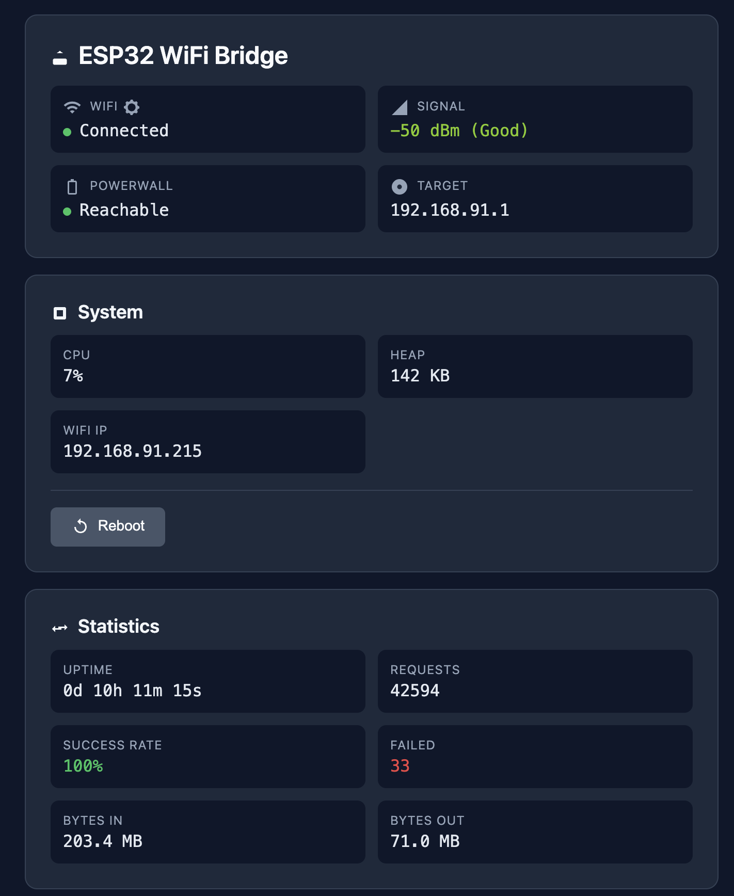

# ESP32-S3-POE-ETH WiFi-Ethernet SSL Bridge

## Quick Install

**Flash directly from your browser (no tools required):**

👉 **https://mccahan.github.io/esp32-wifi-bridge/**

Connect your ESP32-S3-POE-ETH board via USB and click "Install". Works with Chrome, Edge, and Opera.

---

This project uses the ESP32-S3-POE-ETH board (Waveshare) with **ESP-IDF framework** to create a WiFi-Ethernet SSL bridge that:
- Accepts SSL/TLS connections on Ethernet (port 443)
- **Forwards encrypted traffic without decryption** (SSL passthrough)
- Modifies TTL (Time-To-Live) to hide that traffic originates from outside the network
- Forwards to Tesla Powerwall at 192.168.91.1 over WiFi

## Web Dashboard



The device provides a web-based dashboard accessible on the Ethernet interface showing:
- WiFi connection status and signal strength
- Powerwall connectivity
- System metrics (CPU, heap, uptime)
- Proxy statistics (requests, bytes, success rate)
- WiFi signal history chart (24 hours)
- OTA firmware updates

## Hardware

- **Board**: ESP32-S3-POE-ETH (Waveshare)
- **Ethernet Controller**: W5500 (SPI)
- **Framework**: ESP-IDF (native, not Arduino)

### Pin Configuration

| Function | GPIO |
|----------|------|
| MISO     | 12   |
| MOSI     | 11   |
| SCLK     | 13   |
| CS       | 14   |
| INT      | 10   |

## Features

- **WiFi Client**: Connects to Tesla Powerwall AP (192.168.91.1)
- **SSL Passthrough**: Forwards encrypted SSL/TLS traffic without decryption
- **TTL Modification**: Modifies Time-To-Live on outgoing packets to hide external origin
- **DHCP**: Both WiFi and Ethernet interfaces use DHCP
- **mDNS**: Advertises `powerwall.local` with "_powerwall" service on Ethernet interface
- **Web Dashboard**: Real-time status page with auto-refresh
- **WiFi Metrics**: 24-hour signal strength and connection history with 5-minute averages
- **NTP Time Sync**: Automatic time synchronization over Ethernet (non-blocking)
- **OTA Updates**: Upload firmware via web UI or remote GitHub releases
- **Connection Watchdog**: Automatic reboot if proxy connections fail for extended periods

## Architecture

```
[Ethernet Client] <=SSL/TLS (Encrypted)=> [ESP32-S3 Bridge] <=SSL/TLS (Encrypted)=> [Powerwall WiFi]
                                           Port 443 proxy
                                           Port 80 Web UI/OTA
```

This implementation provides **SSL passthrough with TTL modification**:
- **No TLS Termination**: Traffic remains encrypted end-to-end
- **TCP Forwarding**: Simple socket-to-socket forwarding of encrypted data
- **TTL Modification**: Sets TTL=64 on outgoing packets to appear as local traffic
- **Transparent Bridge**: Client connects directly to Powerwall through the bridge

## Web UI & API

### Dashboard (Port 80)

Access the dashboard at `http://powerwall.local/` or `http://<ethernet-ip>/`

Features:
- Real-time WiFi and Powerwall status
- System metrics (CPU, memory, uptime)
- Proxy statistics and request history
- WiFi signal strength chart (24h history)
- WiFi configuration
- Firmware updates (local upload or remote OTA)

### API Endpoints

| Endpoint | Method | Description |
|----------|--------|-------------|
| `/` | GET | Web dashboard |
| `/api/status` | GET | System status JSON |
| `/api/requests` | GET | Recent proxy requests with TTFB/TTLB |
| `/api/logs` | GET | System log entries |
| `/api/wifi-history` | GET | WiFi metrics (24h of 5-min buckets) |
| `/api/update` | GET | Remote OTA status |
| `/api/check-update` | POST | Check for GitHub updates |
| `/api/install-update` | POST | Install update from GitHub |
| `/wifi/scan` | GET | Scan available WiFi networks |
| `/wifi/save` | POST | Save WiFi credentials |
| `/ota/upload` | POST | Upload firmware binary |
| `/reboot` | POST | Trigger device reboot |

## Configuration

Edit `include/config.h` to customize:

```c
// WiFi Settings (or configure via Web UI)
#define WIFI_SSID "TeslaPowerwall"
#define WIFI_PASSWORD ""

// Powerwall IP
#define POWERWALL_IP_STR "192.168.91.1"

// Proxy Settings
#define PROXY_PORT 443
#define PROXY_TIMEOUT_MS 60000
#define TTL_VALUE 64

// NTP Settings
#define NTP_SERVER_PRIMARY "216.239.35.0"    // time.google.com
#define NTP_SERVER_SECONDARY "216.239.35.4"  // time2.google.com

// WiFi Metrics
#define WIFI_METRICS_BUCKET_MINUTES 5        // 5-minute averages
#define WIFI_METRICS_HISTORY_HOURS 24        // 24 hours of history
```

## Building & Deployment

### Build with PlatformIO

```bash
pio run                    # Build firmware
pio run -t upload          # Upload via USB
pio device monitor         # Serial monitor
```

### OTA Deployment

```bash
./deploy.sh                # Build and deploy via OTA (mDNS discovery)
./deploy.sh -a             # Deploy to ALL discovered devices
./deploy.sh -d -i <IP>     # Deploy to specific IP
```

## mDNS Discovery

The service can be discovered on the local network as:
- Hostname: `powerwall.local`
- Service: `_powerwall._tcp`
- Port: 443

```bash
# Discover devices
dns-sd -B _powerwall._tcp
```

## Files

| File | Purpose |
|------|---------|
| `src/main.c` | Core application: web server, WiFi config, OTA, initialization |
| `src/proxy.c` | SSL passthrough proxy with buffer pool and request logging |
| `src/remote_ota.c` | GitHub OTA: version checking and firmware updates |
| `src/wifi_metrics.c` | NTP time sync and WiFi metrics collection |
| `include/config.h` | All configuration constants |
| `include/proxy.h` | Proxy module API |
| `include/wifi_metrics.h` | WiFi metrics API |
| `include/web_ui.h` | Web UI assets (CSS, JavaScript, icons) |

## Dependencies

Uses ESP-IDF components:
- `esp_eth` - Ethernet driver with W5500 support
- `esp_wifi` - WiFi client functionality
- `esp_netif` - Network interface abstraction
- `mdns` - mDNS responder
- `lwip` - TCP/IP stack with SNTP
- `nvs_flash` - Non-volatile storage
- `esp_http_server` - HTTP server for web UI
- `esp_https_ota` - OTA update support

## License

This project is provided as-is for use with ESP32-S3-POE-ETH hardware.
