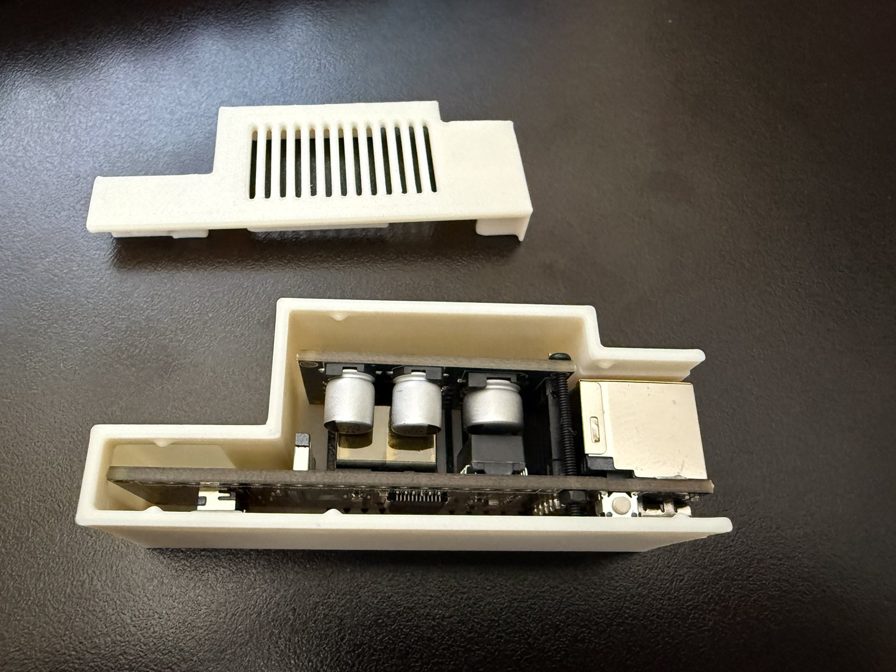
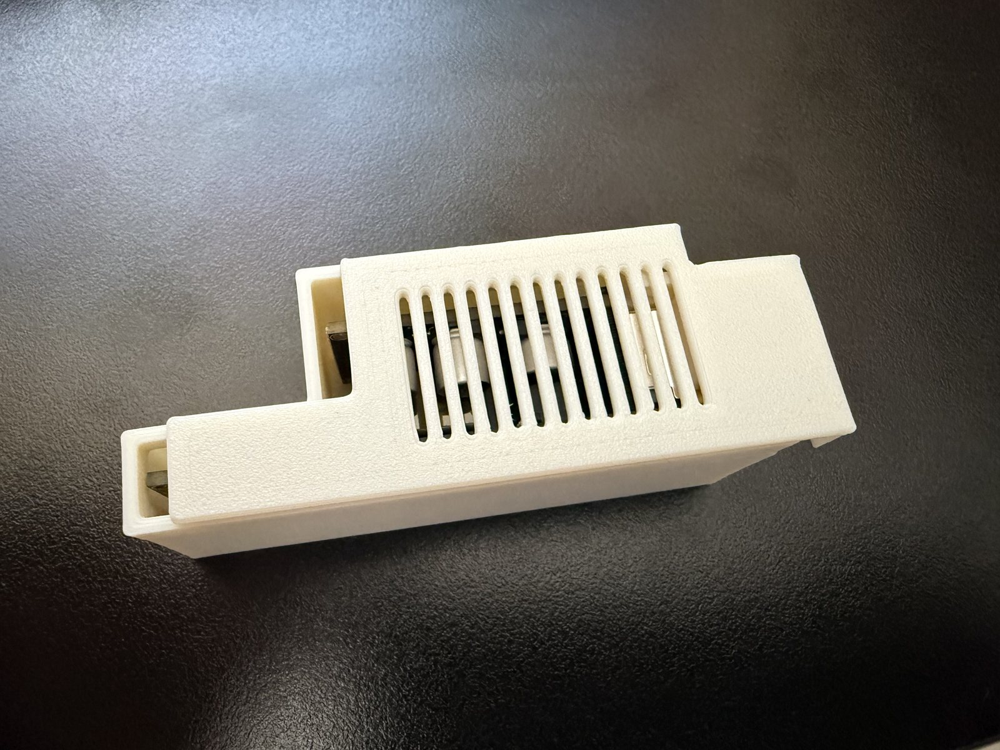
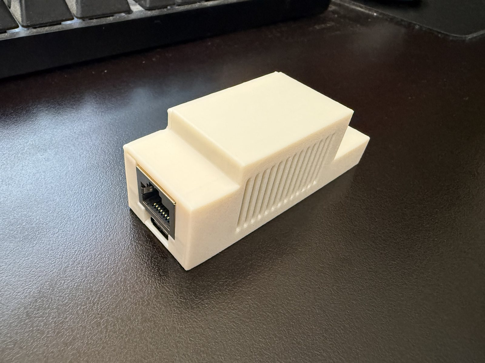
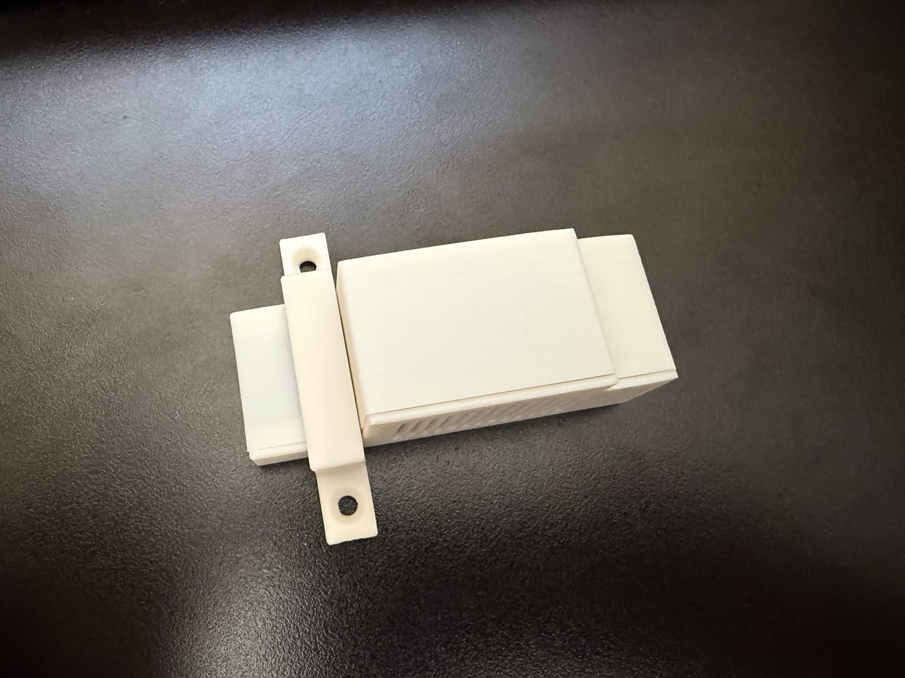
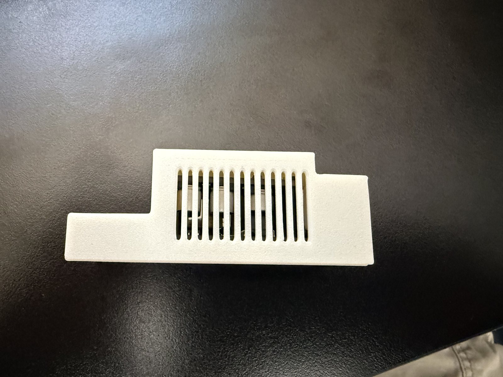

# 3D-printed enclosure

Snap-fit case for the **Waveshare ESP32-S3-POE-ETH** (board + PoE hat). Designed to hang **horizontally** on the wall next to a Tesla Powerwall. Vents are placed so hot air rises and draws cool air through the shell.

ASA, **no supports**.

## Parts

| File | What |
|------|------|
| [esp32_BTM.stl](esp32_BTM.stl) | Bottom shell (board sits here) |
| [esp32_TOP.stl](esp32_TOP.stl) | Lid — slides **left** to snap shut |
| [esp32_MOUNT.stl](esp32_MOUNT.stl) | Wall bracket, two screw holes |

Print one of each.

## Print (ASA)

| Setting | Suggested |
|---------|-----------|
| Material | **ASA** (PETG works; ASA is what this was proven on) |
| Supports | **None** |
| Layer | 0.2 mm |
| Walls | 4 |
| Infill | 15% |
| Chamber | Enclosed printer recommended for ASA (warping) |

Keep the large flat faces on the bed.

## Assembly

1. Seat the ESP32-S3-POE-ETH (with PoE hat) in the **bottom**. RJ45 and USB-C face the open end.
2. Drop the **lid** on and **slide it left** until it snaps. Do not force it straight down.
3. Clip or screw the **mount** onto the back, then hang the whole unit **horizontally** so the vent grille is on the **top** face.

Horizontal wall mount is required for the convection path. Vertical mounting traps heat.

Ethernet and USB-C stay reachable. Slide the lid off to reach **BOOT** / **RESET** (hold BOOT 15 s to force DHCP and clear the admin password).

## Hardware

- Waveshare **ESP32-S3-POE-ETH**
- PoE on the hat (or USB-C for power only)
- Two wall screws for the mount (use anchors if you are going into drywall)

License: same as the firmware — provided as-is for this board.
